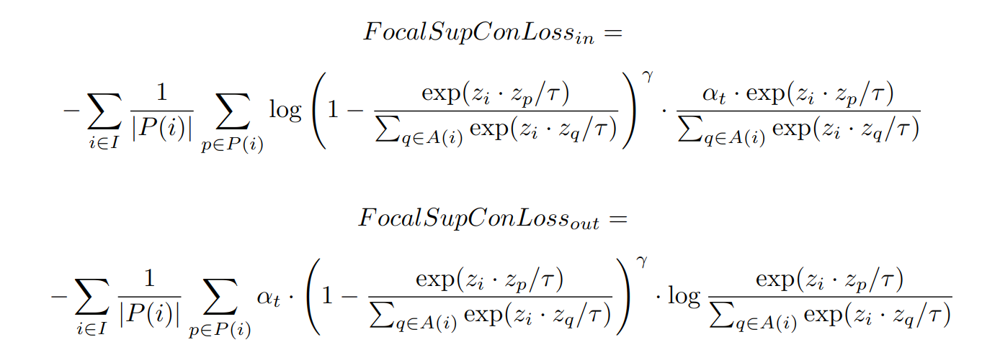

# FocalContrastiveLoss

This is the PyTorch implementation of variants of Supervised Contrastive Loss(https://github.com/HobbitLong/SupContrast):
1. A focal supervised contrastive loss to deal with an imbalanced dataset when training a supervised contrastive model. Parameters are the same as the original focal loss(https://github.com/clcarwin/focal_loss_pytorch).
2. A multilabel supervised contrastive loss to deal with the multilabel dataset. Subjects with a label (1,0,0) and (1,1,0) will be regarded as the same group.
   

